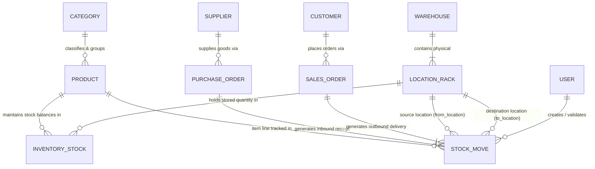
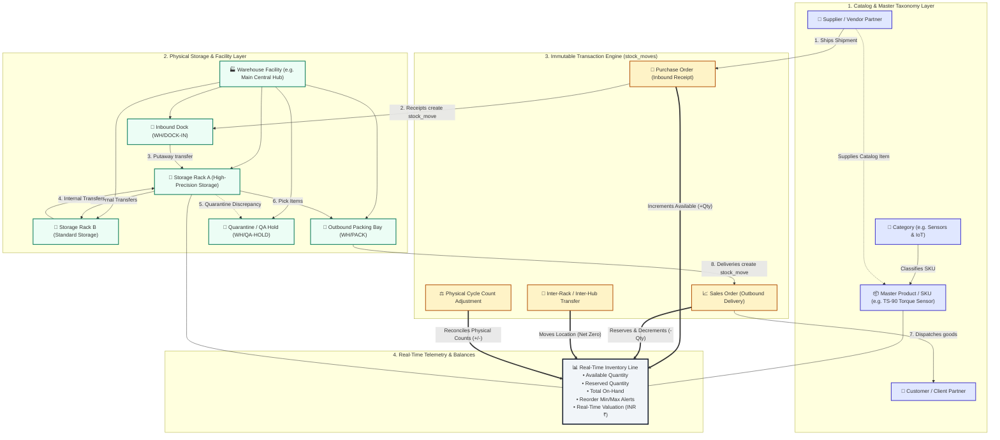
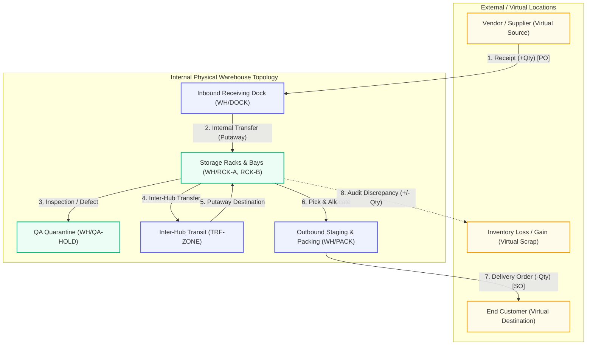
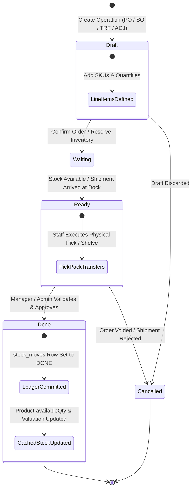
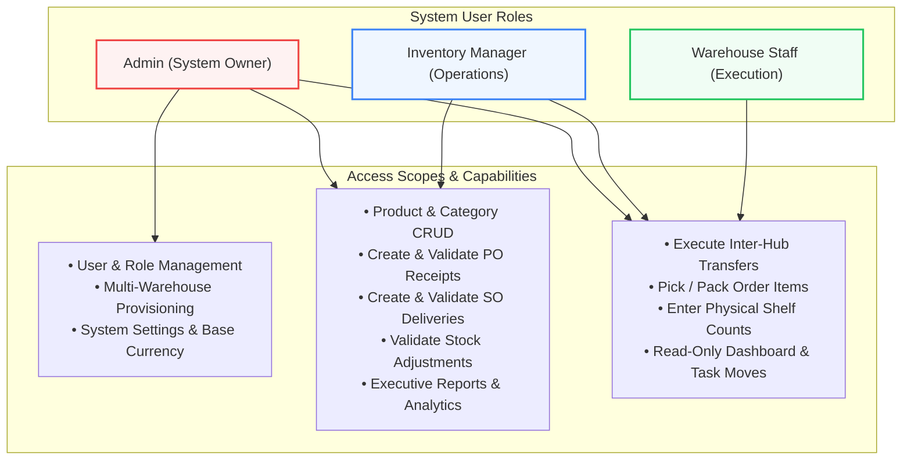

# StockSense — Comprehensive System Architecture & Workflow Specifications

## 1. Executive Summary

**StockSense** is an enterprise-grade, double-entry inventory management system built for high-throughput warehousing, multi-facility visibility, and strict role-based access control.

At its core, StockSense models every inventory change as an immutable **Stock Move** (`stock_moves`). Every item received, shelved, transferred between racks, allocated to orders, or reconciled during cycle counts flows through a centralized, audited state machine.

---

## 2. Entity-Relationship & System Topology

The following diagram details how **Warehouses**, **Sub-Locations / Racks**, **Categories**, **Products**, **Inventory Balances**, **Partners**, and **Stock Moves** are connected in the data layer:

---

## 3. End-to-End Operational Flow & Connection Architecture

The interaction across all system tiers—from master catalog data to physical storage racks, transactional orders, and real-time inventory balances:

---

## 4. Double-Entry Inventory Engine (`stock_moves`)

In StockSense, stock is never created or destroyed out of thin air—it is **moved** between physical or virtual locations:

### Operation Mapping in `stock_moves`:

| Operation | Movement Type | Source (`from_location`) | Destination (`to_location`) | Stock Ledger Effect |
|---|---|---|---|---|
| **Inbound Receipt (PO)** | `receipt` | `NULL` (External Vendor) | Warehouse Dock / Shelf | `+quantity` into stock |
| **Outbound Delivery (SO)** | `delivery` | Warehouse Shelf / Pack Bay | `NULL` (Customer) | `-quantity` from stock |
| **Internal Transfer** | `transfer` | Origin Rack (`WH-1/RCK-A`) | Target Rack (`WH-2/RCK-B`) | Net zero system change; location updated |
| **Stock Count Adjustment** | `adjustment` | `NULL` | Virtual Inventory Loss/Gain | Signed delta (`+` or `-`) with audit reason |

---

## 5. Stock Move Lifecycle State Machine

Every operational movement transitions through an auditable pipeline:

---

## 6. Detailed System Breakdown

### A. Warehouses & Sub-Locations / Racks
1. **Multi-Warehouse Facilities**: Physical distribution centers with distinct addresses, capacity limits, and site operational leads (e.g., *Main Central Hub*, *Production Facility East*).
2. **Sub-Locations & Racks**:
   * **`INTERNAL`**: Standard storage locations for picking and pallet storage (`RCK-A`, `RCK-B`).
   * **`TRANSIT`**: Virtual staging areas for items moving between facilities.
   * **`SCRAP / QA`**: Quarantine locations for defective items or quality holds (`QA-HOLD`).
   * **`VENDOR / CUSTOMER`**: Virtual endpoints for supplier receipts and customer deliveries.
3. **Per-Location Stock Query**: Real-time inspection of on-hand quantities, reserved units, and unit valuation per rack.

---

### B. Categories & Product Taxonomy
1. **Hierarchical Grouping**: Organizes products into domain classifications (*Sensors & IoT*, *Actuators & Motors*, *Controllers*, *Pneumatics & Fluid*).
2. **Consolidated Valuation**: Automatically calculates cumulative stock valuation per category:
   $$\text{Category Stock Value} = \sum (\text{SKU Available Qty} \times \text{Unit Cost Price})$$
3. **Lifecycle**: Supports active and archived categories.

---

### C. Products & Master SKU Management
1. **Catalog Master Record**: Unique SKU code, barcode identifier (EAN-13/Code-128), Category, and Unit of Measure (UOM: `pcs`, `kg`, `m`, `box`, `roll`, `L`).
2. **Safety Thresholds**:
   * **Available Stock**: Unreserved inventory ready to fulfill orders.
   * **Reserved Stock**: Items allocated to active pending sales orders.
   * **Reorder Level ($Min$)**: Automatic threshold triggering replenishment alerts and PO drafts.
3. **Multi-Tier Valuation**: Standard Cost Price vs. Selling Price in base currency (**INR ₹**).

---

## 7. Role-Based Access Control (RBAC) Architecture

### Comprehensive Access Control Matrix

| Functional Area / Action | Admin | Inventory Manager | Warehouse Staff | Enforced Site Behavior |
|---|:---:|:---:|:---:|---|
| **System Settings & Base Currency** | ✅ | ❌ | ❌ | Restricted page; non-admins receive access-restricted fallback notice. |
| **Users & Role Matrix Management** | ✅ | ❌ | ❌ | Hidden from sidebar navigation for non-admins; direct access blocked. |
| **Warehouse & Rack Provisioning** | ✅ Full Provisioning | 👁️ Read-Only Telemetry | 👁️ Read-Only Telemetry | Non-admins can inspect rack stock, but "Add Facility" is gated. |
| **Product & Category CRUD** | ✅ Create / Edit / Delete | ✅ Create / Edit / Delete | 👁️ Read-Only Catalog | Action buttons hidden for Staff; read-only notice banner displayed. |
| **Inbound Receipts (POs)** | ✅ Create & Validate | ✅ Create & Validate | ❌ | Staff cannot create POs or validate inbound receipts. |
| **Sales Orders & Outbound Delivery** | ✅ Create & Validate | ✅ Create & Validate | 🟡 Pick / Pack Only | Staff executes picking and packing; cannot create new sales orders. |
| **Inter-Hub Transfers** | ✅ | ✅ | ✅ | All roles can initiate and execute internal transfers between racks/hubs. |
| **Stock Adjustments & Cycle Counts** | ✅ Full Validation | ✅ Full Validation | 🟡 Count Entry Only | Staff submits count; requires Manager/Admin approval before ledger update. |
| **Executive Reports & Valuation** | ✅ | ✅ | ❌ | Financial valuation and reports restricted to Managers & Admins. |
| **Live Telemetry Dashboard** | ✅ Full Control | ✅ Full Control | 👁️ Read-Only Tasks | Live operational telemetry with quick action button adapted per role. |

---

## 8. Summary of Component Connections

| Component Pair | Relationship | Description |
|---|:---:|---|
| **Category $\leftrightarrow$ Product** | *1 : N* | Categories classify multiple products for catalog browsing, tax defaults, and aggregated financial valuation. |
| **Product $\leftrightarrow$ Inventory Stock** | *1 : N* | Master product records connect to live physical stock balances across multiple warehouses and racks. |
| **Warehouse $\leftrightarrow$ Sub-Location / Rack** | *1 : N* | Facilities contain physical racks, bays, docks, and quarantine zones. |
| **Rack $\leftrightarrow$ Inventory Stock** | *N : N* | Pinpoints exactly which shelf/bay holds a specific product SKU. |
| **Purchase Order $\leftrightarrow$ Stock Move** | *1 : N* | Receiving supplier shipments creates inbound `receipt` moves (`+quantity`). |
| **Sales Order $\leftrightarrow$ Stock Move** | *1 : N* | Fulfilling customer orders reserves stock and creates outbound `delivery` moves (`-quantity`). |
| **Transfer $\leftrightarrow$ Stock Move** | *1 : 1* | Moving goods between racks/warehouses creates `transfer` moves with no net change in total company stock. |
| **Adjustment $\leftrightarrow$ Stock Move** | *1 : 1* | Reconciling physical cycle counts generates `adjustment` moves with mandatory audit reason logging. |
